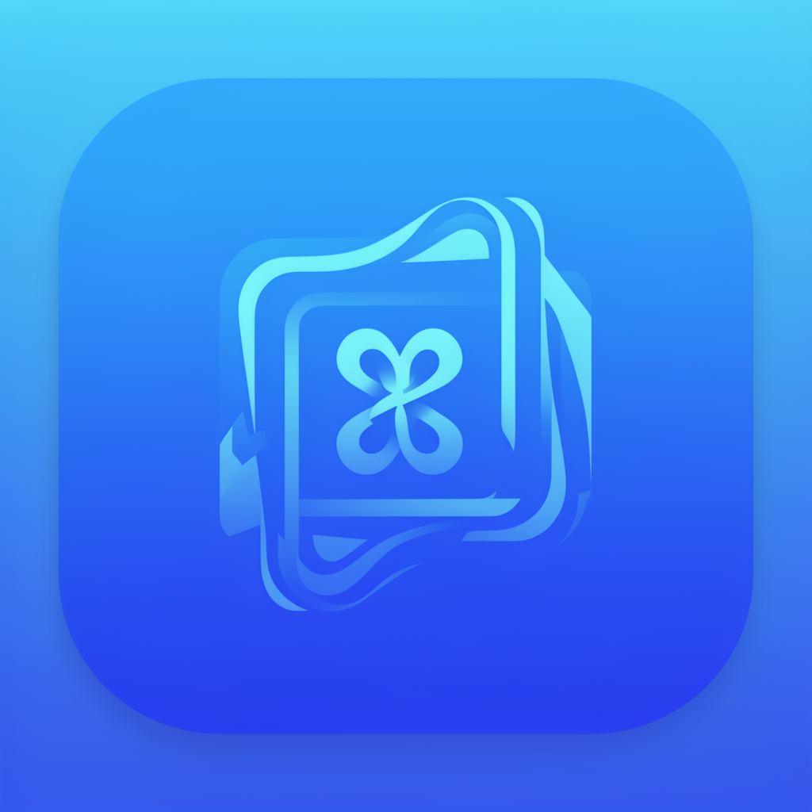
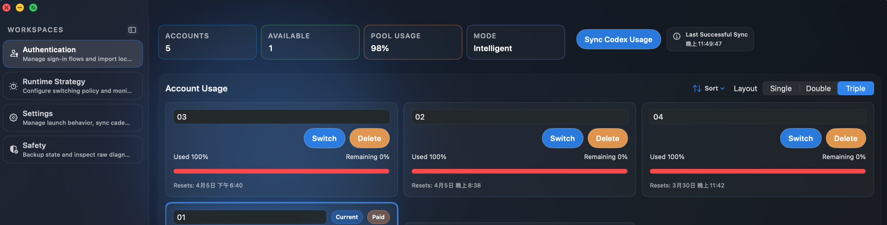
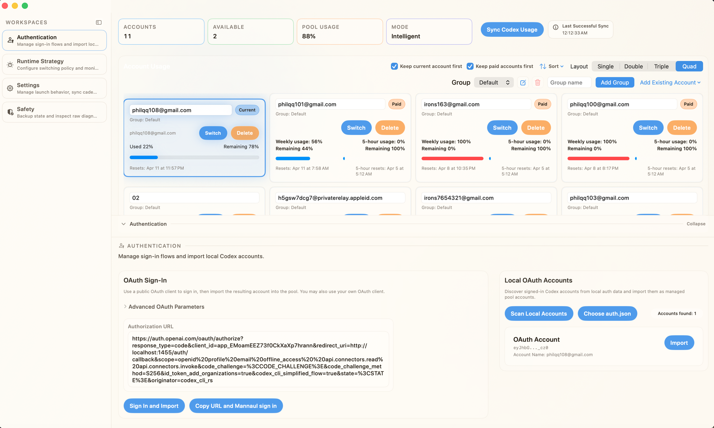
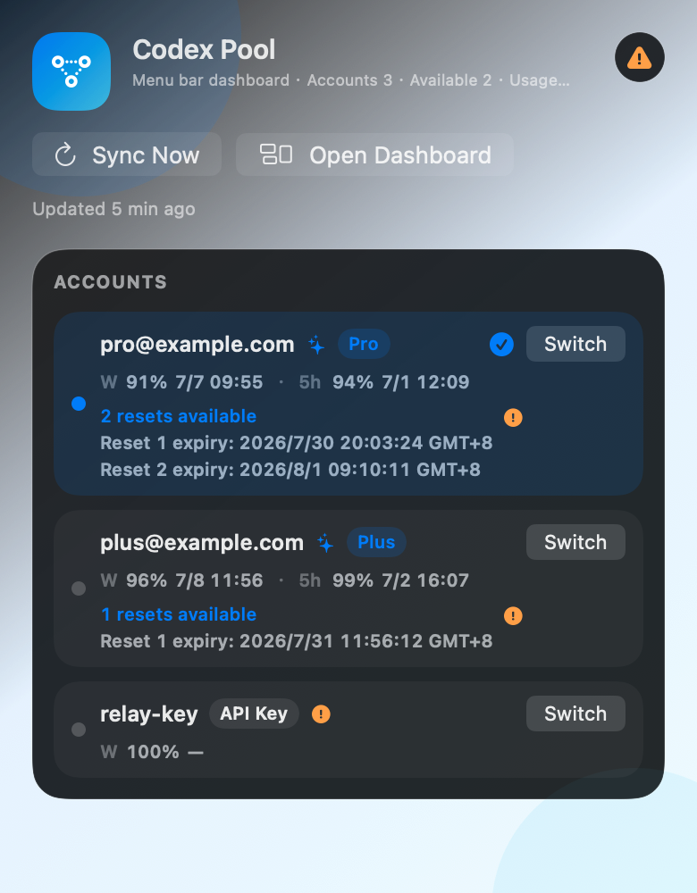
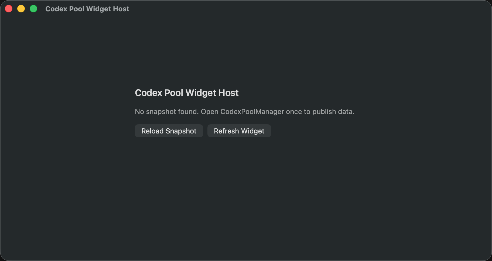

# Codex Pool Manager

<p></p>

Codex Pool Manager 是一款 macOS 工具，让你在同一个控制面板里管理一组 Codex/OpenAI OAuth 账号。

它可以帮助你：
- 跟踪每个账号的配额和剩余用量，
- 快速切换当前启用账号，
- 按智能策略自动轮换账号，
- 通过桌面 Widget 与菜单栏查看状态，
- 通过备份/导出流程进行恢复。

语言： [English](README.md) · [繁體中文](README.zh-Hant.md) · [日本語](README.ja.md) · [한국어](README.ko.md) · [Français](README.fr.md) · [Español](README.es.md)

## 目录

1. [截图](#截图)
2. [主要功能](#主要功能)
3. [智能切换工作原理](#智能切换工作原理)
4. [Widget + 菜单栏](#widget--菜单栏)
5. [App 内更新检查](#app-内更新检查)
6. [认证与账号导入](#认证与账号导入)
7. [工作区](#工作区)
8. [安装](#安装)
9. [从源码构建](#从源码构建)
10. [Release DMG 流程](#release-dmg-流程)
11. [项目结构](#项目结构)
12. [测试](#测试)
13. [故障排查](#故障排查)
14. [安全与隐私说明](#安全与隐私说明)
15. [贡献](#贡献)

## 截图

以下截图均使用 mock 或非敏感测试数据。

### 主仪表板（深色，Mock 数据）



### 顶部总览（浅色，Mock 数据）



### 菜单栏状态（Mock 数据）



### Widget（空状态示例，Mock 状态）



### OpenAI Reset Alert（Mock 数据）


## 主要功能

### 1) 账号池管理

- 新增、编辑、复制和删除账号。
- 分组管理（`新增`、`重命名`、`删除`）。
- 删除分组时会一并删除该组账号。
- 提供排序和布局，便于管理大型账号池。
- `极简` 布局采用自适应卡片宽度，会随窗口宽度自动调整每行卡片数。
- 池统计（`Accounts`、`Available`、`Pool Usage`）具备去重逻辑，避免重复身份被重复计算。

### 2) 多种切换模式

- `Intelligent`：按剩余容量和策略阈值自动选择最佳账号。
- `Manual`：固定使用你手动选择的账号。
- `Focus`：锁定当前账号，不进行智能轮换。

### 3) 用量同步与诊断

- 对所有符合条件的账号同步 Codex/OpenAI 用量。
- 处理同步排除场景（缺 token、缺 account id、API/网络错误）。
- 显示上次成功同步时间和同步错误信息。
- 提供原始用量 JSON 和切换日志用于诊断。

### 4) OAuth 登录流程

- App 内 OAuth 登录并直接导入。
- 手动流程：复制授权 URL、粘贴 callback URL、再导入。
- 扫描常见本地路径中的 auth 数据。
- 将本地 OAuth sessions/accounts 导入账号池。

### 5) 桌面集成

- 支持 macOS 原生通知（同步失败/恢复、低用量、自动切换结果）。
- 提供显示实时剩余信息的菜单栏工具。
- 提供 macOS Widget 快速查看状态。

### 6) 备份与恢复

- 导出 JSON 快照。
- 导出可重新抓取快照（敏感，含重新抓取所需字段）。
- 导入 JSON 快照用于迁移/恢复。

### 7) 界面与多语言

- 深色模式 + 浅色模式。
- 可在设置中切换语言。
- App/Widget 时间文案采用本地化格式化。

### 8) 用量分析与 Schedule 规划

- 提供独立 `Schedule` 工作区规划多账号重置时间轴。
- 提供每日/每周用量分析，识别使用习惯。
- 显示覆盖/未覆盖时段，提前发现可能无账号可用的空档。
- 提供单账号趋势线、阈值事件与异常摘要。
- 支持导出分析数据（JSON/CSV）用于后续分析。

### 9) OpenAI 重置监控

- 提供独立 `OpenAI Reset Alert` 工作区监控付费账号重置。
- 同时监控周重置与 5 小时重置目标。
- 当重置时间早于预期（在容差范围内）时标记为提前重置信号。
- 支持桌面通知与事件历史记录。
- 提供每日通知上限，降低 API 短暂异常时的误报噪音。

## 智能切换工作原理

本节描述运行时真实行为，帮助用户理解切换时机。

### 账号资格

只有**未被排除同步/调度**的账号才会参与自动切换候选。

常见排除原因：
- 缺少 API token，
- 缺少 ChatGPT account id，
- 同步错误状态。

### 付费/非付费剩余逻辑

- 非付费账号：按周剩余比例（`remainingUnits / quota`）判断。
- 付费账号（默认）：按 **5 小时剩余** 百分比为主。
- 付费账号特殊情况：若周剩余已是 `0%`，则改以周剩余为准（视为已耗尽）。

### 候选选择

系统会在可用候选中选择智能剩余比例最高者。

周剩余 `<= 0` 的账号不会被选为候选。

### 触发切换条件

在 `Intelligent` 模式下，必须同时满足以下条件才会切换：

1. 有有效候选；
2. 当前账号低于智能切换阈值；
3. 候选优于当前账号；
4. 冷却间隔已结束。

### Focus 模式行为

切到 `Focus` 后会锁定当前账号，避免意外跳号。

Focus 模式不会进行智能自动切换。

### 低用量提醒阈值是独立设置

存在两个不同阈值：

- 智能切换阈值：控制**何时允许切换**。
- 低剩余提醒阈值：控制**何时显示警告/通知**。

二者相互独立。

## Widget + 菜单栏

### Widget

- Widget 通过主程序暴露的本地 bridge 快照读取数据。
- 无快照时，Widget 会显示友好的空状态提示。
- 时间线刷新策略：
  - 有快照时约每 `60s` 刷新，
  - 无快照时约每 `10s` 刷新。

### 菜单栏

- 菜单栏标题显示简要状态（剩余%、付费 5h 剩余、更新时间）。
- 展开内容显示当前账号、重置时间与更新时间。
- 周期刷新（约每 15 秒）并支持手动刷新。

## App 内更新检查

- 读取 GitHub 最新 Release 并与当前版本比较。
- 支持版本字符串归一化（例如 `v1.8.0` 与 `1.8.0`）。
- 会按设备架构优先选择安装包（`Apple Silicon` / `Intel`）。
- 更新弹窗提供 `Install now`、`Manual download`、`Skip this version`。

## 认证与账号导入

### 本地账号扫描路径

会扫描以下常见 auth JSON 路径：

- `~/.codex/auth.json`
- `~/.config/codex/auth.json`
- `~/.openai/auth.json`

### 公开 OAuth Client

默认支持公开 client 流程，也允许使用你自己的 OAuth client 参数。

### 手动 callback 流程

当浏览器 callback 无法在 App 内直接完成时：

1. 点击 `Copy URL and Manual sign in`；
2. 在浏览器完成登录；
3. 将 callback URL 粘贴回输入框；
4. 点击 `Import`。

## 工作区

界面按工作区分层，方便理解和操作边界。

### Authentication

- OAuth 登录面板
- 高级 OAuth 参数
- 本地 OAuth 账号扫描/导入

### Runtime Strategy

- 模式选择（`Intelligent`、`Manual`、`Focus`）
- 智能切换阈值
- 低剩余提醒阈值
- `切换并启动` 的目标 App 选择
- 智能建议面板

### Schedule

- 托管账号重置时间轴总览
- 每日/每周用量分析摘要
- 覆盖缺口提示，便于规划账号使用
- 单账号趋势线与阈值/异常事件
- 分析数据导出（`Copy JSON`、`Export CSV`、`Export JSON`）

### OpenAI Reset Alert

- 付费账号重置目标追踪
- 提前重置容差配置
- 提前重置信号摘要与记录
- 桌面提醒与事件列表管理

### Settings

- 启动行为
- 自动同步开关与间隔
- 语言
- 外观（system/dark/light）

### Safety

- 备份/导出/导入控制
- 原始数据/日志诊断面板

## 安装

### 方式 A：从 Releases 下载预构建 DMG

Release 提供两种架构 DMG：

- `CodexPoolManager-<version>-apple-silicon.dmg`
- `CodexPoolManager-<version>-intel.dmg`

请选择与你 Mac 架构匹配的版本。

### 方式 B：在 Xcode 从源码运行

见下一节。

## 从源码构建

### 要求

- macOS
- Xcode 16+

### 步骤

```bash
cd /path/to/AIAgentPool
open CodexPoolManager.xcodeproj
```

在 Xcode 中：

1. 选择 `CodexPoolManager` scheme。
2. 选择本机 Mac 作为 destination。
3. Build and Run。

如需测试 Widget，请确保相关 target 使用同一个签名 Team。

## Release DMG 流程

自动 DMG 打包与 notarization 配置在：

- `.github/workflows/release-dmg.yml`
- `scripts/build_and_notarize_dmg.sh`

### 流程亮点

- 同时构建 `arm64` 与 `x86_64`。
- 产物命名使用 release 版本/tag（非 commit hash）。
- 使用 Developer ID Application 证书签名。
- 对每个 DMG 执行 notarize 与 staple。
- 上传到 workflow artifacts 与 GitHub Release assets。

### 必需 GitHub Secrets

- `APPLE_CERTIFICATE_P12_BASE64`
- `APPLE_CERTIFICATE_PASSWORD`
- `KEYCHAIN_PASSWORD`
- `APPLE_TEAM_ID`
- `APPLE_API_KEY_ID`
- `APPLE_API_ISSUER_ID`
- `APPLE_API_PRIVATE_KEY_BASE64`

详细配置请参考 [RELEASE_DMG.md](RELEASE_DMG.md)。

## 项目结构

```text
AIAgentPool/
├─ CodexPoolManager/                 # 主 macOS App target
├─ CodexPoolWidget/                  # Widget extension target
├─ CodexPoolWidgetHost/              # Widget 桥接/测试 companion host
├─ Domain/Pool/                      # 核心状态、切换规则、快照模型
├─ Features/PoolDashboard/           # UI 与流程协调器
├─ Infrastructure/Auth/              # OAuth、auth 文件访问/切换服务
├─ Infrastructure/Usage/             # 用量同步 client/service
├─ CodexPoolManagerTests/            # 单元测试
├─ CodexPoolManagerUITests/          # UI 测试
├─ .github/workflows/release-dmg.yml # Release workflow
└─ scripts/build_and_notarize_dmg.sh # 本地/CI DMG 脚本
```

## 测试

可在 Xcode 运行，或使用命令行：

```bash
xcodebuild \
  -project CodexPoolManager.xcodeproj \
  -scheme CodexPoolManager \
  -destination 'platform=macOS' \
  test
```

Release 组态构建：

```bash
xcodebuild \
  -scheme CodexPoolManager \
  -destination 'platform=macOS' \
  -configuration Release \
  build
```

多语言字符串基础检查：

```bash
for f in CodexPoolManager/en.lproj/Localizable.strings \
         CodexPoolManager/zh-Hans.lproj/Localizable.strings \
         CodexPoolManager/zh-Hant.lproj/Localizable.strings; do
  plutil -lint "$f"
done
```

## 故障排查

### “Syncing...” 卡住

- 先确认网络/API 是否可用。
- 查看 Sync Error 提示内容。
- 确认账号有有效 token 与 account id。
- 稍后再手动同步一次。

### Widget 显示 “No snapshot available”

- 先打开一次 CodexPoolManager（主程序会发布 widget bridge）。
- 等几秒后刷新 Widget。
- 确认本机防火墙/网络规则未阻挡 localhost loopback。

### 本地 OAuth 扫描不到数据

- 使用 `Choose auth.json` 手动授权。
- 确认 auth 文件存在于已知路径之一。

### Intelligent 模式不切换

- 检查当前剩余是否低于切换阈值。
- 检查冷却间隔。
- 检查候选账号资格与剩余值。
- Focus 模式下本来就不进行智能切换。

## 安全与隐私说明

- 可重新抓取导出可能包含敏感信息。
- 未脱敏前，不要公开分享原始日志或导出内容。
- 内部快照请使用安全存储。
- OAuth/client 凭据请按你的安全策略管理。

## 贡献

欢迎提交 Issue 和 PR。

建议 PR 范围：
- 每个 PR 聚焦单一行为变更，
- Domain 或 coordinator 逻辑应包含测试覆盖，
- UI 改动附前后截图。

---

如果这个项目对你的 Codex 账号管理有帮助，欢迎给仓库点个 Star。
